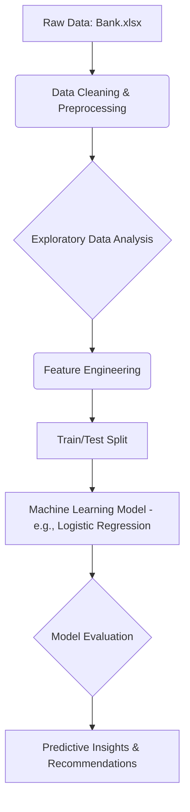

# Financial Analysis: Personal Loan Prediction

A Python-based project for Thera Bank that analyzes customer data to build a predictive model for personal loan acceptance. The goal is to identify high-potential customers for targeted marketing campaigns, optimizing the bank's marketing budget and increasing loan conversion rates.

## Features

• **Data Loading & Cleaning**: Ingesting the Bank.xlsx dataset and preprocessing it by removing irrelevant columns like ID and ZIP Code and handling negative values in the Experience column.

• **Exploratory Data Analysis (EDA)**: Visualizing data distributions and correlations to identify key demographic and financial factors that influence a customer's decision to accept a loan.

• **Feature Engineering**: Creating new features, such as income categories, to improve the model's ability to learn from the data.

• **Predictive Modeling**: Building a classification model to predict the Personal Loan variable, which indicates whether a customer accepted the loan.

• **Model Evaluation**: Evaluating the model's performance on unseen data using metrics like accuracy, precision, recall, and F1-score to ensure its effectiveness.

## Architecture

The project pipeline starts with raw data from `Bank.xlsx`, which is then cleaned and preprocessed. Next, exploratory data analysis is performed to inform the feature engineering process. The data is then split for training and testing a machine learning model. The model's performance is evaluated, leading to predictive insights and business recommendations.

## Workflow



## Setup

Clone this repository to your local machine. Install the required Python libraries using `pip install pandas numpy scikit-learn matplotlib seaborn jupyter`. Open the `Financial_Data_Analysis.ipynb` file in a Jupyter environment. Run the cells sequentially to execute the full analysis pipeline.

## Usage

Run the Jupyter Notebook to generate the analysis and a trained predictive model. The final output is the trained model and its performance metrics.

## Input/Output

**Input File**: Bank.xlsx (contains customer data).

**Output**: A trained machine learning model and a report detailing its performance metrics.

## Dependencies

- pandas
- numpy
- scikit-learn
- matplotlib
- seaborn
- jupyter

## Business Insights

The project aims to provide actionable insights by identifying the key characteristics of customers who are likely to accept a personal loan. This can lead to a more efficient marketing strategy, reduced costs, and a higher conversion rate for Thera Bank's personal loan campaigns.

## Project Structure

```
Finance Analysis/
├── README.md
├── Financial_Data_Analysis.ipynb
├── Bank.xlsx
└── requirements.txt
```

## Getting Started

1. **Clone the repository**
   ```bash
   git clone <repository-url>
   cd "Finance Analysis"
   ```

2. **Install dependencies**
   ```bash
   pip install -r requirements.txt
   ```

3. **Launch Jupyter Notebook**
   ```bash
   jupyter notebook Financial_Data_Analysis.ipynb
   ```

4. **Run the analysis**
   Execute all cells in the notebook sequentially to perform the complete analysis pipeline.

## Data Description

The Bank.xlsx file contains data on 5000 customers, including:
- Customer demographic information (age, income, etc.)
- Customer's relationship with the bank (mortgage, securities account, etc.)
- Customer response to the last personal loan campaign (Personal Loan)

Among these 5000 customers, only 480 (9.6%) accepted the personal loan offered in the previous campaign.

## Model Performance

The project evaluates model performance using standard classification metrics:
- **Accuracy**: Overall correctness of predictions
- **Precision**: Proportion of positive predictions that were correct
- **Recall**: Proportion of actual positives that were identified
- **F1-Score**: Harmonic mean of precision and recall

## Contributing

1. Fork the repository
2. Create a feature branch
3. Make your changes
4. Submit a pull request

## License

This project is licensed under the MIT License - see the LICENSE file for details.